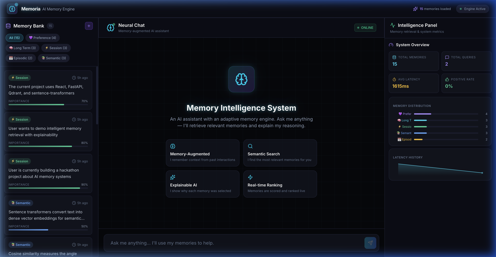
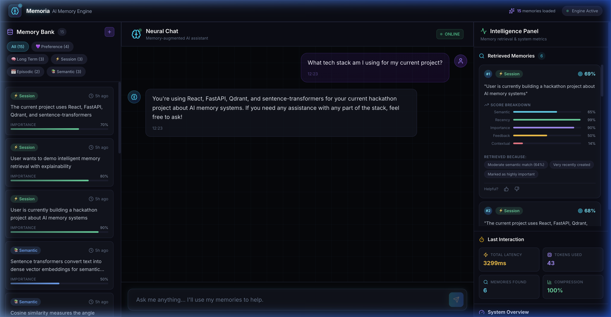
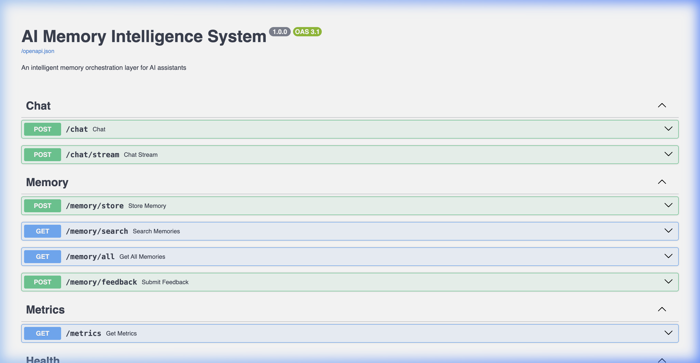

<div align="center">

# 🧠 Memoria — AI Memory Intelligence System

### *An intelligent memory orchestration layer for AI assistants — without retraining the model.*

[](https://www.typescriptlang.org/)
[](https://reactjs.org/)
[](https://fastapi.tiangolo.com/)
[](https://python.org/)
[](https://qdrant.tech/)
[](https://vitejs.dev/)
[](https://tailwindcss.com/)
[](https://docker.com/)

---

🌐 **[Live Demo](https://memoria-ai-memory-intelligence-2mmmc84n6.vercel.app/)** &nbsp;·&nbsp; 📡 **[API Docs](https://nishtha-agarwal-211-memoria-ai-backend.hf.space/docs)** &nbsp;·&nbsp; 🐛 **[Report Bug](https://github.com/nishtha-agarwal-211/memoria-ai-memory-intelligence/issues)** &nbsp;·&nbsp; 💡 **[Request Feature](https://github.com/nishtha-agarwal-211/memoria-ai-memory-intelligence/issues)**

</div>

---

## 📸 Screenshots

<div align="center">

### 🖥️ Main Dashboard — 3-Panel Layout


<br/><br/>

### 💬 Chat with Memory Retrieval & Explainable AI


<br/><br/>

### 📡 Backend API Documentation (FastAPI + Swagger)


</div>

---

## 🎯 What is Memoria?

**Memoria** is a full-stack AI Memory Intelligence System that gives any LLM a persistent, intelligent memory. Instead of retraining models, it:

- 🧠 **Stores** memories with semantic embeddings across 5 memory types
- 🔍 **Retrieves** relevant memories using hybrid search (vector + keyword + metadata)
- 📊 **Ranks** memories with a multi-factor scoring system
- 💉 **Injects** only the best memories into LLM prompts
- 💡 **Explains** exactly *why* each memory was selected

> Think of it as **"ChatGPT with a brain-like adaptive memory system."**

---

## ✨ Key Features

<table>
<tr>
<td width="50%">

### 🔮 Memory Engine
- **5 memory types**: `preference` · `long_term` · `session` · `episodic` · `semantic`
- **Conflict resolution**: auto-detects contradictions, prioritizes recent truth
- **Feedback loop**: 👍/👎 voting updates future ranking scores

</td>
<td width="50%">

### 🎯 Hybrid Retrieval
- Semantic vector search via **Qdrant**
- Keyword overlap matching
- Metadata filtering by type
- Configurable top-K selection

</td>
</tr>
<tr>
<td width="50%">

### 📊 Intelligent Ranking
```
final_score = 0.45 × semantic_similarity
            + 0.20 × recency
            + 0.15 × importance
            + 0.10 × feedback_score
            + 0.10 × contextual_match
```

</td>
<td width="50%">

### 🧪 Explainable AI
Every retrieved memory comes with:
- ✅ Similarity percentage
- 📈 Score breakdown (5 factors)
- 💬 Human-readable reasons
- 🏅 Rank position

</td>
</tr>
<tr>
<td colspan="2">

### 💎 Premium UI
Futuristic 3-panel dark theme · Glassmorphism & glow effects · Smooth Framer Motion animations · Real-time streaming responses · Live latency sparklines & system metrics

</td>
</tr>
</table>

---

## 🏗️ Architecture

```
┌────────────────┐   ┌──────────────────────────────────────────┐   ┌──────────────┐
│                │   │              FastAPI Backend              │   │              │
│  React + Vite  │──▶│  Memory Engine → Ranking → Compression   │──▶│   Qdrant DB  │
│  + TailwindCSS │   │  Conflict Resolver → Explanation Engine  │   │  (Vectors)   │
│  + Framer      │◀──│  LLM Service (OpenAI-compatible + Mock)  │   │              │
│                │   │                                          │   │              │
└────────────────┘   └──────────────────────────────────────────┘   └──────────────┘
                                        │
                                        ▼
                              ┌──────────────────┐
                              │  sentence-        │
                              │  transformers     │
                              │  BAAI/bge-small   │
                              └──────────────────┘
```

---

## 🚀 Quick Start

### Prerequisites
- Python 3.10+
- Node.js 18+
- (Optional) Docker for Qdrant server

### Backend Setup

```bash
cd backend

# Create virtual environment
python -m venv venv
source venv/bin/activate  # Windows: venv\Scripts\activate

# Install dependencies
pip install -r requirements.txt

# Copy environment file
cp .env.example .env
# Edit .env to add your OpenAI API key (optional — mock mode works without it)

# Start the server
uvicorn app.main:app --reload --port 8000
```

> ⚡ First startup downloads the embedding model (~130MB) — takes ~30 seconds.
> After that, startup is fast.

### Frontend Setup

```bash
cd frontend

# Install dependencies
npm install

# Start dev server
npm run dev
```

Open **http://localhost:5173** — you're ready! 🎉

---

## 🔗 Live Demo

| Service | URL | Status |
|---------|-----|--------|
| 🌐 **Frontend** | [memoria-ai-memory-intelligence.vercel.app](https://memoria-ai-memory-intelligence-2mmmc84n6.vercel.app/) |  |
| 📡 **Backend API** | [memoria-ai-backend.hf.space](https://nishtha-agarwal-211-memoria-ai-backend.hf.space/docs) |  |

---

## 🔑 Environment Variables

| Variable | Default | Description |
|----------|---------|-------------|
| `OPENAI_API_KEY` | `sk-mock-key` | OpenAI API key (mock mode if not set) |
| `OPENAI_MODEL` | `gpt-4o-mini` | LLM model name |
| `QDRANT_MODE` | `memory` | `memory` (in-process) or `server` (Docker) |
| `EMBEDDING_MODEL` | `BAAI/bge-small-en-v1.5` | Sentence transformer model |

---

## 📡 API Endpoints

| Method | Endpoint | Description |
|--------|----------|-------------|
| `POST` | `/chat` | Send message, get memory-augmented response |
| `POST` | `/chat/stream` | Same as above, but streaming (SSE) |
| `POST` | `/memory/store` | Store a new memory |
| `GET` | `/memory/search?query=...` | Search memories by query |
| `GET` | `/memory/all` | List all stored memories |
| `POST` | `/memory/feedback` | Submit 👍/👎 feedback |
| `GET` | `/metrics` | System metrics for dashboard |
| `GET` | `/health` | Health check endpoint |

> 💡 Full interactive API docs available at [`/docs`](https://nishtha-agarwal-211-memoria-ai-backend.hf.space/docs)

---

## 🛠️ Tech Stack

| Layer | Technology |
|-------|-----------|
| **Frontend** | React, TypeScript, Vite, TailwindCSS v4, Framer Motion, shadcn/ui, Lucide Icons |
| **Backend** | FastAPI, Python, Pydantic v2, SSE Streaming |
| **Vector DB** | Qdrant (in-memory or server mode) |
| **Embeddings** | sentence-transformers (BAAI/bge-small-en-v1.5, 384-dim) |
| **LLM** | OpenAI-compatible API (with mock fallback) |
| **Deployment** | Vercel (Frontend) · HuggingFace Spaces (Backend) · Docker |

---

## 📁 Project Structure

```
memoria/
├── frontend/                # React + Vite + TailwindCSS
│   ├── src/
│   │   ├── components/
│   │   │   ├── chat/        # Neural Chat panel
│   │   │   ├── memory/      # Memory Bank timeline
│   │   │   ├── dashboard/   # Intelligence metrics panel
│   │   │   └── ui/          # Reusable UI components (shadcn)
│   │   ├── hooks/           # Custom React hooks
│   │   ├── lib/             # Utility functions
│   │   └── App.tsx          # Main 3-panel layout
│   └── package.json
├── backend/                 # FastAPI + Python
│   ├── app/
│   │   ├── main.py          # App entry point + CORS
│   │   ├── config.py        # Environment configuration
│   │   ├── routes/          # API route handlers
│   │   ├── services/        # Business logic (memory, LLM, ranking)
│   │   ├── models/          # Pydantic schemas
│   │   └── database/        # Qdrant vector store
│   └── requirements.txt
├── Dockerfile               # Backend container
├── docker-compose.yml       # Full stack orchestration
└── README.md
```

---

## 🏆 Built for Hackathon

This project is designed to be **demo-friendly**:

- ⚡ **Zero config** — Works out of the box with in-memory Qdrant and mock LLM
- 📦 **Pre-seeded** — Comes with 15 sample memories across all categories
- 👁️ **Visual** — Every feature is visible in the UI — no hidden functionality
- 🧠 **Explainable** — Shows exactly how the AI makes memory decisions
- 🚀 **Deployed** — Live on Vercel + HuggingFace Spaces

---

## 🤝 Contributing

Contributions are welcome! Feel free to open issues or submit pull requests.

1. Fork the repository
2. Create your feature branch (`git checkout -b feature/amazing-feature`)
3. Commit your changes (`git commit -m 'Add amazing feature'`)
4. Push to the branch (`git push origin feature/amazing-feature`)
5. Open a Pull Request

---

## 📄 License

Distributed under the **MIT License**. See `LICENSE` for more information.

---

<div align="center">

**Built with ❤️ for the Hackathon**

⭐ Star this repo if you found it useful!

</div>
